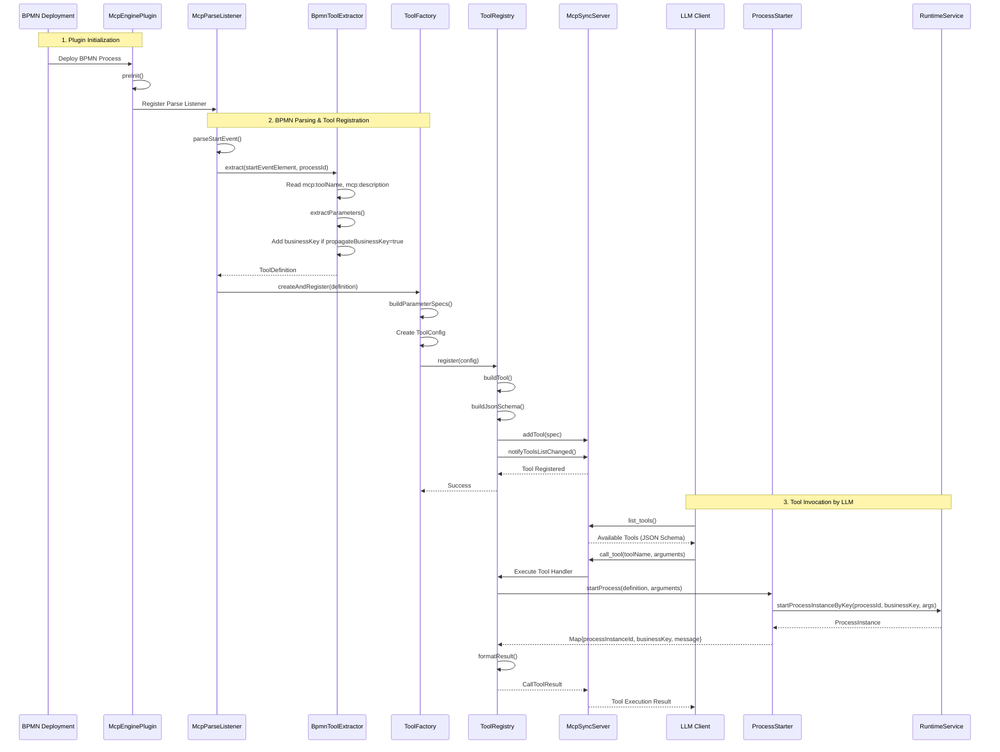
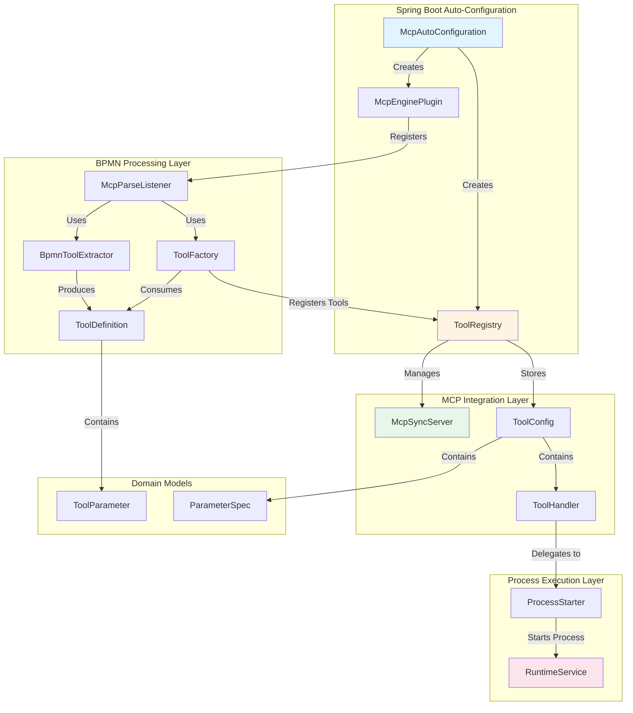

# MCP Tool Integration for Fluxnova BPM
Automatically registers Fluxnova BPMN processes as MCP (Model Context Protocol) tools, allowing AI assistants to start workflow processes.

## Business Key Propagation
Business Key propagation from parent (Parent process starting another process via MCP) calling process has limited support. You are required to inject the business key into your prompt, e.g " - BusinessKey is ABC-123".

This approach can be tidied up once strategic support for LLM Invocation is imported into Fluxnova

## How It Works

### Architecture
BPMN File → Parse Listener → Tool Extractor → Tool Factory → Tool Registry → MCP Server ↓ Process Starter

1. **BPMN Parsing**: When a BPMN file is deployed, `McpParseListener` intercepts start events
2. **Tool Extraction**: `BpmnToolExtractor` reads MCP attributes from start events
3. **Tool Creation**: `ToolFactory` creates a tool configuration and handler
4. **Registration**: `ToolRegistry` registers the tool with the MCP server
5. **Invocation**: When an AI calls the tool, `ProcessStarter` starts a Fluxnova process instance

### Package Structure
```
org.finos.fluxnova.ai.mcp/ 
├── model/ # Domain objects (ToolDefinition, ToolParameter, ToolHandler) 
├── engine/ # Fluxnova integration (parsing, extraction, execution) 
│ ├── McpEnginePlugin 
│ ├── McpParseListener 
│ ├── BpmnToolExtractor 
│ ├── ToolFactory 
│ └── ProcessStarter 
├── registry/ # MCP server integration (tool registration) 
│ ├── ToolRegistry 
│ └── ToolConfig 
└── autoconfigure/ # Spring Boot auto-configuration
```
## Usage

### Spring AI MCP Dependencies

### Maven Dependencies

Add the following dependencies to your `pom.xml`:

```xml
<dependencies>
    <!-- Spring AI MCP Server -->
    <dependency>
        <groupId>org.springframework.ai</groupId>
        <artifactId>spring-ai-starter-mcp-server-webmvc</artifactId>
    </dependency>

    <!-- MCP Fluxnova Extension -->
    <dependency>
        <groupId>io.mcp.tools</groupId>
        <artifactId>mcp-fluxnova-extension</artifactId>
    </dependency>
</dependencies>
```
### Spring MCP Properties
Spring AI needs to be configured. Below is an example, **but please refer to Spring AI documentation**.
```
# MCP Server Configuration
spring.ai.mcp.server.name=fluxnova-mcp-server
spring.ai.mcp.server.version=1.0.0
spring.ai.mcp.server.protocol=streamable
spring.ai.mcp.server.stdio=false
spring.ai.mcp.server.type=sync
```

### 1. Add MCP Attributes to BPMN Start Events

TODO See associated MCP Plugin - Link TBC 
```xml
<bpmn:definitions 
    xmlns:bpmn="http://www.omg.org/spec/BPMN/20100524/MODEL"
    xmlns:mcp="http://fluxnova.finos.org/schema/1.0/ai/mcp">
  
  <bpmn:process id="kycProcess" isExecutable="true">
    <bpmn:startEvent id="start" 
                     mcp:type="mcpToolStart"
                     mcp:toolName="KYC Review Tool"
                     mcp:description="Initiates KYC check on customer">
      <bpmn:extensionElements>
        <mcp:parameters>
          <mcp:parameter paramName="customerName" paramType="string" />
          <mcp:parameter paramName="customerId" paramType="string" />
        </mcp:parameters>
      </bpmn:extensionElements>
      <bpmn:outgoing>flow1</bpmn:outgoing>
    </bpmn:startEvent>
    <!-- rest of process -->
  </bpmn:process>
</bpmn:definitions>
```
### 2. Deploy BPMN File
Deploy the BPMN file to Fluxnova. The tool is automatically registered.

### 3. AI Invokes Tool
When an AI assistant calls the tool:
```

{
  "toolName": "KYC Review Tool",
  "arguments": {
    "customerName": "John Doe",
    "customerId": "12345"
  }
}
```
A Fluxnova process instance starts with these variables.

## MCP Attributes
| Attribute | Required | Description |
|-----------|----------|-------------|
| `mcp:type` | No | Set to `"mcpToolStart"` to mark as MCP tool |
| `mcp:toolName` | Yes | Name of the tool (shown to AI) |
| `mcp:description` | Yes | Description of what the tool does |
| `mcp:propagateBusinessKey` | No | Whether to use `businessKey` argument (default: `true`) |


#### Parameters
Define parameters in <mcp:parameters>:
```
<mcp:parameter paramName="name" paramType="type" />
```
Supported types: string, number, boolean, object, array

### Configuration
Auto-configured via Spring Boot. No manual configuration needed.

Optional: Enable Debug Logging
```
logging:
  level:
    org.finos.fluxnova.ai.mcp: DEBUG
```

## Architecture diagrams
### MCP Tool Registration and Execution Flow


### Component Responsibilities

| Component | Purpose                                                                                            |
|-----------|----------------------------------------------------------------------------------------------------|
| **McpEnginePlugin** | Fluxnova process engine plugin that registers the BPMN parse listener during engine initialization |
| **McpParseListener** | Listens for start events during BPMN parsing and triggers tool extraction                          |
| **BpmnToolExtractor** | Reads MCP-specific XML attributes and elements to create ToolDefinition objects                    |
| **ToolFactory** | Converts ToolDefinitions into ToolConfigs and registers them with the registry                     |
| **ToolRegistry** | Manages tool lifecycle, builds JSON schemas, and integrates with McpSyncServer                     |
| **ProcessStarter** | Executes the actual process start when an LLM invokes a tool                                       |
| **ToolDefinition** | Domain model representing extracted BPMN metadata                                                  |
| **ToolParameter** | Represents a single parameter with name, type, and optional flag                                   |
| **ToolConfig** | Configuration object containing tool metadata and execution handler                                |

# Testing
Directly testable via `npx @modelcontextprotocol/inspector`. After connecting to your Fluxnova server, you can invoke the process via the Tools menu.

# Troubleshooting
## Tool not registering?

- Enable DEBUG logging
- Check BPMN has mcp:toolName attribute
- Verify namespace: xmlns:mcp="http://fluxnova.finos.org/schema/1.0/ai/mcp"`
- Check logs for "Registered MCP tool" message

## Parameters not working?
- Use paramName and paramType (not mcp:paramName)
- Supported types: string, number, boolean, object, array
