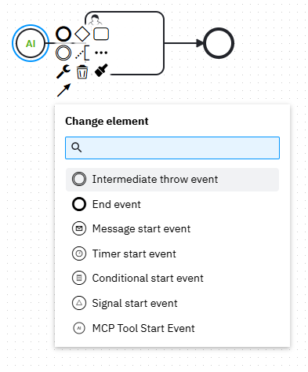
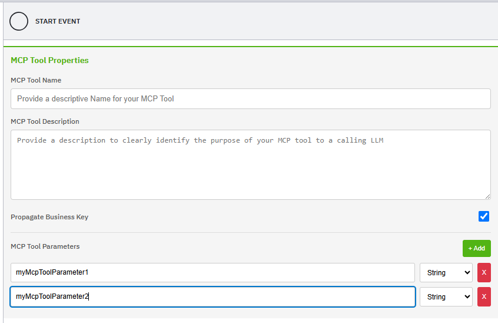
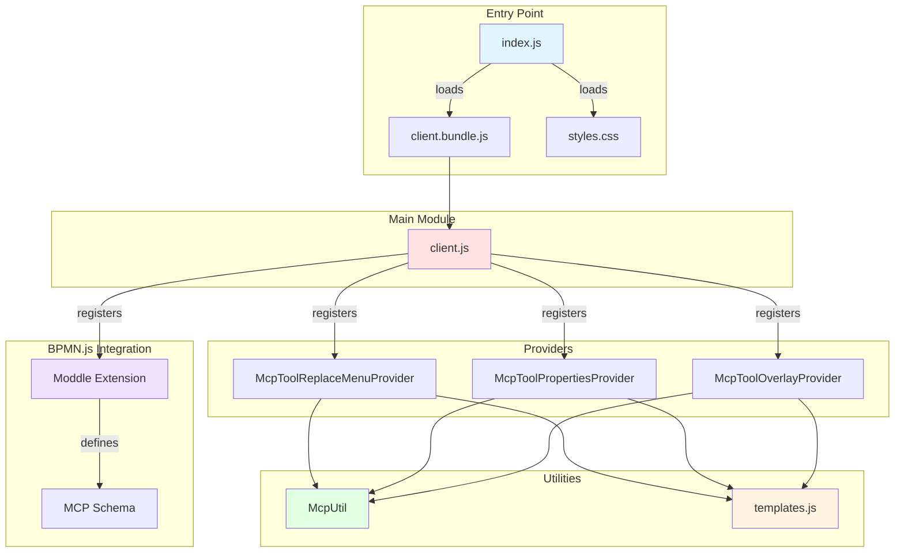
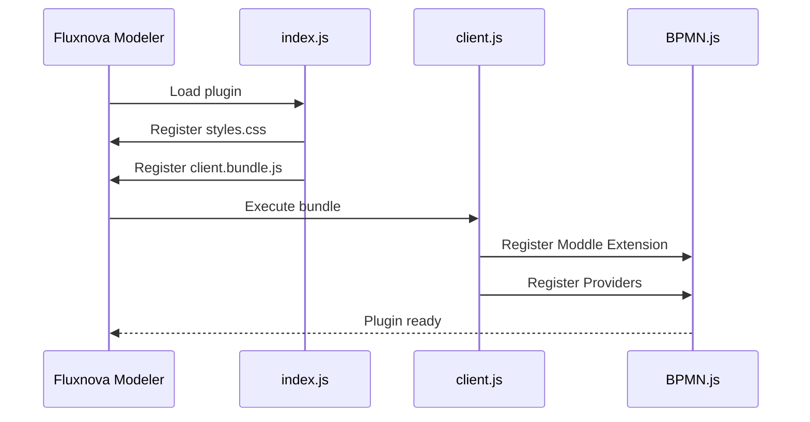
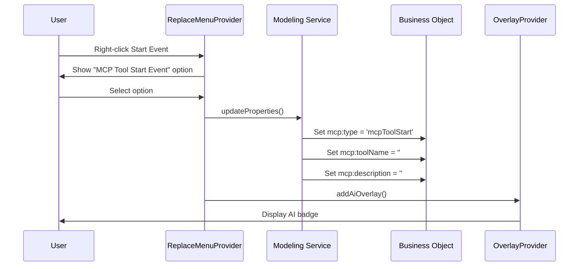
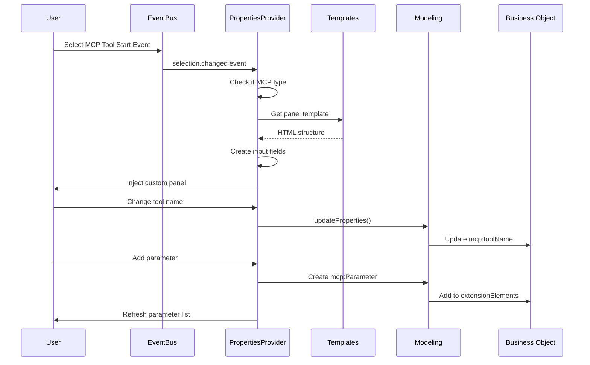
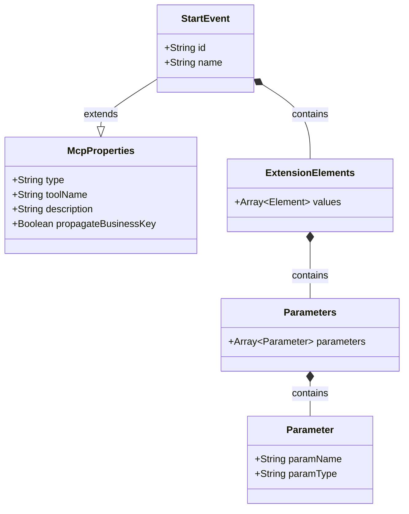
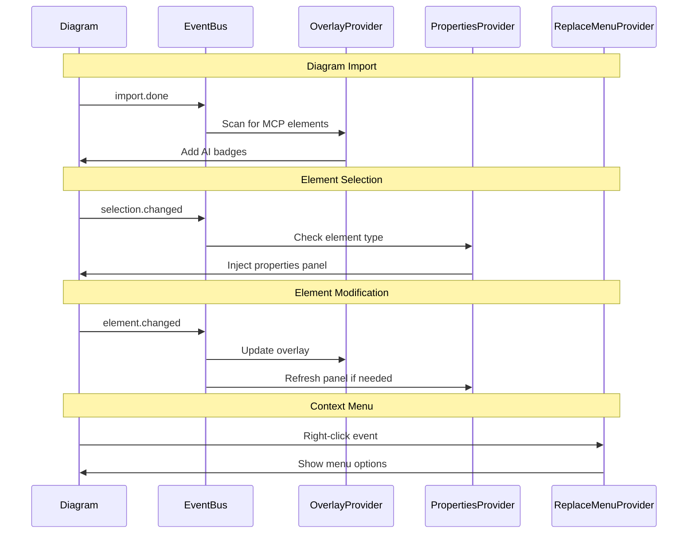

# MCP Tool Plugin
A Fluxnova Modeler plugin that adds MCP (Model Context Protocol) Tool Start Event functionality to BPMN diagrams, enabling AI-powered workflow integration.

<p float="left">
  
  
</p>

## Overview
This plugin extends the Fluxnova Modeler with custom MCP Tool Start Events that can be configured with tool names, descriptions, and parameters for LLM integration.

## Architecture
### Component Structure


## File Organization
```
mcp-tool-plugin/
├── index.js                    # Plugin entry point
├── package.json                # Dependencies & scripts
├── webpack.config.js           # Build configuration
├── client/
│   ├── client.js              # Main registration module
│   ├── styles.css             # UI styling
│   ├── templates.js           # HTML templates
│   ├── provider/
│   │   ├── McpToolReplaceMenuProvider.js    # Context menu integration
│   │   ├── McpToolPropertiesProvider.js     # Properties panel
│   │   └── McpToolOverlayProvider.js        # AI badge overlay
│   └── util/
│       └── McpUtil.js         # Shared utilities
```

## Component Interaction Flow
1. Plugin Initialization

2. User Creates MCP Tool Start Event

3. Properties Panel Interaction

4. Data Model Structure


### BPMN XML Structure
When a MCP Tool Start Event is created, it generates the following XML structure:
```xml
<bpmn:startEvent id="StartEvent_1" mcp:type="mcpToolStart"
    mcp:toolName="MyTool"
    mcp:description="Tool description"
    mcp:propagateBusinessKey="true">
        <bpmn:extensionElements>
            <mcp:Parameters>
            <mcp:Parameter paramName="input1" paramType="String"/>
            <mcp:Parameter paramName="count" paramType="Integer"/>
            </mcp:Parameters>
        </bpmn:extensionElements>
</bpmn:startEvent>
```
## Event Flow


## Parameter Types
Supported parameter types for MCP Tool inputs:

```
String - Text values
Boolean - True/false values
Integer - Whole numbers
Long - Large whole numbers
Double - Decimal numbers
Date - Date/time values
```

# Build
## Install dependencies
npm install

## Build plugin
npm run build

